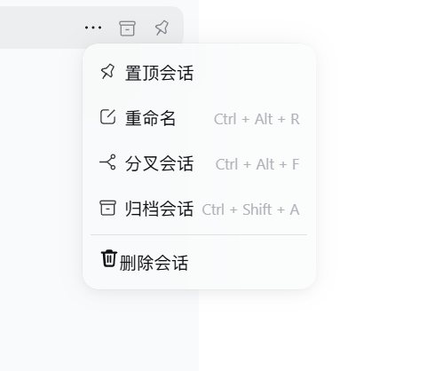
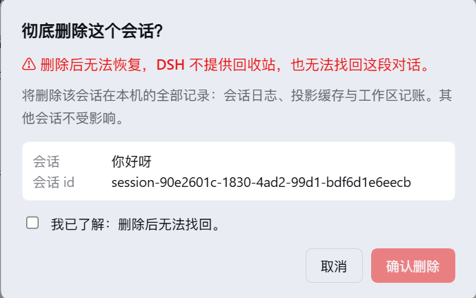

# dsh-plugin-simple-delete-session


[English](README.en.md)


> 给 DeepSeek Harness（DSH）的侧边栏会话菜单加一个 **「删除会话」**：二次确认后**彻底删除**这一个会话，**不影响其他会话**，且**无法找回**。





---

## 功能

- **侧边栏会话行的「…」菜单 →「删除会话」**（红色，排在内置的 置顶 / 重命名 / 分叉 / 归档 之后）。
- **二次确认对话框**：显示会话标题与会话 id，红字说明「删除后无法恢复」，必须勾选「我已了解：删除后无法找回」才能点删除；会话正在运行时额外提示，按钮变为「停止并删除」。
- **彻底删除**：删除该会话自己的日志目录（`<DSH_HOME>/sessions/<项目>/<会话id>/`），并从内存会话表、工作区记账、归档与置顶集合中移除，随后立即从侧边栏消失。
- **删的就是当前会话时自动跳转**：自动切到最近使用过的另一个会话；一个都不剩时回到「新会话」空状态，不会停在已删除会话的页面上。
- **只删这一个**：其他会话、工作区本身、目录、附件、DSH 配置都不受影响。
- 中英双语，跟随界面语言。

---

## 兼容性

- 已在 **DSH 桌面端 0.2.0-rc.1**（Windows）实测通过；`package.json` 里 `dsh.engines.dsh` 声明为 `>=0.1.0-rc.6`。
- 桌面端与 `dsh web` 共用同一份实现，插件只用公开的 Cordis 服务与官方 slot，不修改 DSH 安装目录里的任何文件。

---

## 安装

前提：DSH 桌面端或 `dsh web`；下面命令里的 profile 名按你的实际情况替换（桌面端通常是 `desktop`）。

### 从 GitHub 安装

```sh
dsh plugin --profile desktop add github:WovenJunct/dsh-plugin-simple-delete-session
```

（本仓库就在 https://github.com/WovenJunct/dsh-plugin-simple-delete-session ；fork 的话把 `WovenJunct` 换成你自己的用户名。）

### 从本地目录安装

```sh
dsh plugin --profile desktop add file:<绝对路径>/dsh-plugin-simple-delete-session
```

Windows 也可以直接用仓库里的 `install.cmd`：

```bat
install.cmd            rem 装进 desktop profile
install.cmd web        rem 装进 web profile
```

### 安装后

1. **重启 DSH**（Host 半需要在启动时注册删除接口）；
2. 刷新页面（Ctrl+Shift+R）；
3. 侧边栏任意会话行 →「…」→ 最下方 **删除会话**。

卸载：

```sh
dsh plugin --profile desktop remove dsh-plugin-simple-delete-session
```

> 本地开发提示：DSH 安装时会把插件目录**复制成一份快照**，所以改完源码要重新执行一次 `dsh plugin add`（或把改动的文件同步到 profile 的 `node_modules/dsh-plugin-simple-delete-session/`），再重启 DSH 才会生效。

---

## License

MIT —— 见 [LICENSE](LICENSE)。
